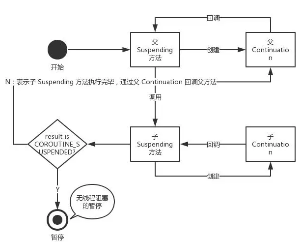

#                           Kotlin Coroutine 原理以及运行机制透析

*   [Kotlin/KEEP kotlin 协程实现规范] (https://github.com/Kotlin/KEEP/blob/master/proposals/coroutines.md)

*   [project loom] (http://cr.openjdk.java.net/~rpressler/loom/)

## 示例代码

```
    suspend fun postItem(item: Item): PostResult {
        val token = requestToken()
        val post = createPost(token, item)
        val postResult = processPost(post)
        return postResult
    }

```

## Kotlin Coroutine 核心原理

*   1:  Continuation and suspending functions

*   2:  CPS(Continuation Passing Style) transform and Switch SM (State Machine)

*   3:  suspendCoroutine functions

*   4:  coroutine Builders


##  Continuation and suspending functions

  ```
        Kotlin编译器会对suspending functions 进行特殊处理,对代码进行转换,从而实现suspending机制。
        Kotlin编译器主要做了下面这三项处理：
            1:  在挂起函数参数列表中添加Continuation类型入参作为参数列表的最后一个参数,并且返回值变为Any?
            2:  在函数内部创建Continuation类型的匿名内部类作为val sm变量
            3:  在函数内部对其他suspending函数的调用变为switch形式的状态机

        接下来详细介绍一下这三项处理

        编译器处理后的函数 postItem

        fun postItem(item: Item, cont: Continuation): Any? {

          // 编译之后新增加的Continuation类型的匿名内部类
          val sm = cont as? ThisSM ?: object : ThisSM {
            fun resume(…) {
              postItem(null, this)
            }
          }

          switch (sm.label) {
            case 0:
              sm.item = item
              sm.label = 1
              return requestToken(sm)
            case 1:
              val item = sm.item
              val token = sm.result as Token
              sm.label = 2
              return createPost(token, item, sm)
            case 2:
              val post = sm.result as Post
              sm.label = 3
              return processPost(post, sm)
            case 3:
              return sm.result as PostResult
        }

        下面对编译之后的方法进行必要的说明以方便理解

        Continuation：函数参数和匿名内部类
            suspending函数编译之后薪增加Continuation类型参数,并且返回值类型变为Any?

                fun postItem(item: Item, cont: Continuation): Any?

            suspending函数编译之后新增加Continuation类型的匿名内部类

                val sm = cont as? ThisSM ?: object : ThisSM {
                  fun resume() {
                    postItem(null, this)
                  }
                }

            Continuation这个名字来源于CPS(Continuation-Passing-Style)
            CPS是一种比较特殊的Callback. Continuation中文翻译为连续体,意思就是后续的部分.
            对于requestToken函数来说,Continuation就是createPost函数和processPost函数.
            常见的CPS中,Continuation部分都会被放在回调接口中实现,这是一种编程风格.


            /**
             * Interface representing a continuation after a suspension point that returns value of type `T`.
             */
            @SinceKotlin("1.3")
            public interface Continuation<in T> {
                /**
                 * Context of the coroutine that corresponds to this continuation.
                 */
                public val context: CoroutineContext

                /**
                 * Resumes the execution of the corresponding coroutine passing successful or failed [result] as the
                 * return value of the last suspension point.
                 */
                public fun resumeWith(result: Result<T>)
            }


            /**
             * Resumes the execution of the corresponding coroutine passing [value] as the return value of the last suspension point.
             */
            @SinceKotlin("1.3")
            @InlineOnly
            public inline fun <T> Continuation<T>.resume(value: T): Unit = resumeWith(Result.success(value))


            /**
             * Resumes the execution of the corresponding coroutine so that the [exception] is re-thrown right after the
             * last suspension point.
             */
            @SinceKotlin("1.3")
            @InlineOnly
            public inline fun <T> Continuation<T>.resumeWithException(exception: Throwable): Unit = resumeWith(Result.failure(exception))


            通过上面的Continuation接口定义以及扩展函数的定义,我们可以看到resume扩展函数用来resume【恢复】suspending【暂停的】 Coroutine的执行.

            如何恢复暂停的Coroutine的执行?

            从上面的示例代码可以看到,postItem函数对应的Continuation类型的匿名内部类的resume函数会去回调postItem函数自己(但入参发生了变化,后面会解释).

            并且,在postItem函数内部调用其他suspending函数的时候会传递这个Continuation,

            后续函数可以通过Continuation重新回调postItem函数.

            小结：每个suspending函数编译后会增加一个Continuation类型的参数.
                 每个suspending函数都有一个回调自己的Continuation实现类,
                 并且这个类会被传递给这个suspending函数所调用的其它suspending函数,
                 这些子函数可以通过Continuation回调父函数以恢复暂停的程序。

```

##  CPS(Continuation Passing Style) transform and Switch SM (State Machine)

        Switch状态机:
            suspending函数编译之后,会将原来的函数体变为一个由switch语句构成的状态机：

            switch (sm.label) {
              case 0:
                sm.item = item
                sm.label = 1
                return requestToken(sm)
              case 1:
                val item = sm.item
                val token = sm.result as Token
                sm.label = 2
                return createPost(token, item, sm)
              case 2:
                val post = sm.result as Post
                sm.label = 3
                return processPost(post, sm)
              case 3:
                return sm.result as PostResult


            这么做的原因是什么呢?
            Kotlin Coroutine的运行依赖于各种Callback机制.
            也就是说,一个suspending函数调用到最后,其实就是注册一个回调.
            方法的执行结果就是通过这个回调来处理.
            当回调注册完毕之后,当前的线程就没有必要再等待下去了,接下来就是方法返回,结束调用.【这句话的意思就是:协程让出线程的使用权限,使线程回到线程池中以便其他协程来使用】
            所以,大家能看到这个switch语句中,每个case都会返回。


            上述switch (sm.label){}代码块中
            每个case都有调用sm.label = N(除了最后一个 case).
            这里的N表示的是当前case的下一个case所对应的label标签的值.
            这个值被记录在sm实例中,然后sm会做为Continuation类型的参数传递个当前case中的子suspending方法。
            子suspending函数(requestToken,createPost等)会将sm设置进回调接口.
            当回调发生,并且suspending方法完成执行时sm会回调它所对应的suspending函数(本例中为postItem),
            并根据label中的值执行对应case中的语句.从而实现程序执行的恢复.
            上面这几段内容解释了suspending函数是如何暂停的,以及又是如何恢复的问题.

            接下来逐行解释switch (sm.label)的代码块的逻辑,以便更好的理解


            case 0

                首先,在case 0中,通过sm.item = item将入参item保存在状态机实例sm(类型为ThisSM,实现Continuation接口)中,
                以使后续调用能够通过Continuaton获得入参.然后通过sm.label = 1设置下一步的状态.
                从后续的代码中也可以看到,在每个case中,都会将sm.label设置为下一个case的值,这样在通过Continuation(就是sm)回调时,
                就知道下一步要调用哪个方法了.接下来就是调用requestToken方法,可以看到在编译之后requestToken多了一个Continuation类型的入参.

            case 1

                当requestToken设置的回调被触发时,通过sm回调postItem函数.此时label=1因此执行case 1.
                通过调用val item = sm.item,从sm中获取参数item.
                通过调用val token = sm.result as Token获取requestToken方法的返回值token.
                通过调用sm.label = 2将label设置为下一步的case.
                调用createPost(token, item, sm)

            case 2

                同case 1的内容类似略.

            case 3

                return sm.result as PostResult 从Continuation中获得返回值.


        Continuation的父子调用:

            到目前为止,我们已经知道了suspending函数是通过CPS和SM机制来实现协程的挂起[suspending]和恢复[resume].

            但有一个细节没有解释:一个suspending函数对应的Continuation是如何知道它是应该回调当前的suspending函数,

            还是应该回调上一级的suspending函数的呢?


            在一个suspending函数中创建它所对应的Continuation时,

            会将从入参传入的Continuation作为父Continuation引入新创建的Continuation.

            因为每个suspending方法所创建的Continuation是基于CoroutineImpl的,所以看一下CoroutineImpl的源代码


            abstract class CoroutineImpl(
                arity: Int,
                @JvmField
                protected var completion: Continuation<Any?>?
            ) : Lambda<Any?>(arity), Continuation<Any?> {

                @JvmField
                protected var label: Int = if (completion != null) 0 else -1

                override fun resume(value: Any?) {
                    processBareContinuationResume(completion!!) {
                        doResume(value, null)
                    }
                }

                override fun resumeWithException(exception: Throwable) {
                    processBareContinuationResume(completion!!) {
                        doResume(null, exception)
                    }
                }

                protected abstract fun doResume(data: Any?, exception: Throwable?): Any?

            }

            @kotlin.internal.InlineOnly
            internal inline fun processBareContinuationResume(completion: Continuation<*>, block: () -> Any?) {
                try {
                    val result = block()
                    if (result !== COROUTINE_SUSPENDED) {
                        @Suppress("UNCHECKED_CAST")
                        (completion as Continuation<Any?>).resume(result)
                    }
                } catch (t: Throwable) {
                    completion.resumeWithException(t)
                }
            }


            CoroutineImpl构造函数有一个Continuation类型的入参completion, 这个completion代表的是父Continuation.

            调用resume函数的时候会先调用processBareContinuationResume函数.

            processBareContinuationResume的第一个入参是父Continuation,第二个入参block就是doResume函数,也就是对当前suspending函数的调用.

            如果当前suspending函数的返回结果不是COROUTINE_SUSPENDED,即执行成功时,就会通过调用completion.resume(result)的方式回调父Continuation,并返回执行结果。




```
        小结:

            Kotlin Coroutine suspending 函数在编译之后会发生显著变化:
                首先,suspending方法增加一个Continuation类型的入参,用于实现回调.

                返回值变为Any?类型,既可以表示真实的结果,也可表示Coroutine的执行状态.

                然后,编译器会为这个suspending函数生产一个类型为Continuation的匿名内部类(扩展CoroutineImpl),

                用于对这个suspending函数自身的回调,并可以在这个suspending函数执行完毕之后,

                回调这个suspending函数上一级的父函数。

                最后,这个suspending函数如果调用其它suspending函数,会将这些调用转换为一个switch形式的状态机,

                每个case表示对一个suspending子函数的调用或最后的return.

                同时,生成的Continuation匿名内部类会保存下一步需要调用的suspending函数的label值,

                表示应该执行switch中的哪个case,从而串联起整个调用过程

```


##  suspendCoroutine functions
```

    以上小节介绍了Kotlin Coroutine suspending函数实现挂起和恢复的原理,

    但函数调用有头有尾,suspending函数调用的结束在哪里呢?

    我们知道Kotlin Coroutine还是基于Callback机制实现的.

    所以,suspending函数调用到最后,就应当是将Kotlin Coroutine自己的回调接口Continuation注册到某种Future技术的回调接口中.

    但是我们在普通的Suspending函数中压根访问不到Continuation,那究竟是如何做到的呢?

    这里是通过suspendCoroutine函数来实现的.

    suspendCoroutine函数是kotlin-stdlib-common标准库的一部分,

    它可以在kotlin-stdlib-common模块中的CoroutinesLibrary.kt文件中找到.

    /**
     * Obtains the current continuation instance inside suspend functions and suspends
     * currently running coroutine.
     *
     * In this function both [Continuation.resume] and [Continuation.resumeWithException] can be used either synchronously in
     * the same stack-frame where suspension function is run or asynchronously later in the same thread or
     * from a different thread of execution. Repeated invocation of any resume function produces [IllegalStateException].
     */
    @SinceKotlin("1.1")
    public suspend inline fun <T> suspendCoroutine(crossinline block: (Continuation<T>) -> Unit): T =
        suspendCoroutineOrReturn { c: Continuation<T> ->
            val safe = SafeContinuation(c)
            block(safe)
            safe.getResult()
        }

    suspendCoroutine函数的入参是一个名称为block的函数类型: (Continuation<T>) -> Unit

    这个函数类型有一个类型为Continuation的入参.

    所以可以拿到Continuation,并且将其注册到某种Future回调机制中了。

    看一下Kotlin Coroutine官方文档中的示例,演示了如何使用suspendCoroutine函数

    将CompletableFuture同Kotlin Coroutine集成:

    suspend fun <T> CompletableFuture<T>.await(): T = suspendCoroutine<T> { cont: Continuation<T> ->
                  whenComplete { result, exception ->
                    if (exception == null) // the future has been completed normally
                      cont.resume(result)
                    else // the future has completed with an exception
                      cont.resumeWithException(exception)
                  }
    }

    从上面的代码可以看出,正是因为suspendCoroutine函数的入参block: (Continuation<T>) -> Unit

    拥有一个Continuation类型的入参,才可以使得我们使用suspendCoroutine函数与各种Future回调机制集成.

    进一步观察suspendCoroutine函数内部的实现原理,suspendCoroutine函数内部调用了suspendCoroutineOrReturn函数,

    但直接观察源码无法了解suspendCoroutineOrReture函数的实现：

    inline suspend fun <T> suspendCoroutineOrReturn(crossinline block: (Continuation<T>) -> Any?): T =
        throw NotImplementedError("Implementation is intrinsic")


    suspendCoroutineOrReturn函数只起到一个标记的作用,实现细节隐藏在了编译阶段.

    但它的实现方式又和普通的suspending函数不同,所以要定义一个特殊函数,以区别对待.


```


##  coroutine Builders

```
    suspendCoroutine函数可以看做是Kotlin Coroutine执行调用的终点,

    接下来要讨论的是Kotlin Coroutine调用的起点.

    因为suspending函数不能直接被普通函数调用.

    如果普通函数要调用suspending函数的话就必须通过Coroutine Builder来创建协程，并且在协程内部调用suspending函数.

    Kotlin Coroutine核心和扩展模块提供了多种Coroutine Builder.

    这些Coroutine Builder有着不同的作用:

    runBlocking{}能够挂起当前线程,

    mono{}可以将Coroutine转换为Spring Reactor Project中的Mono类型.

    /**
     * Creates cold [mono][Mono] that will run a given [block] in a coroutine.
     * Every time the returned mono is subscribed, it starts a new coroutine.
     * Coroutine returns a single, possibly null value. Unsubscribing cancels running coroutine.
     *
     * | **Coroutine action**                  | **Signal to sink**
     * | ------------------------------------- | ------------------------
     * | Returns a non-null value              | `success(value)`
     * | Returns a null                        | `success`
     * | Failure with exception or unsubscribe | `error`
     *
     * Coroutine context is inherited from a [CoroutineScope], additional context elements can be specified with [context] argument.
     * If the context does not have any dispatcher nor any other [ContinuationInterceptor], then [Dispatchers.Default] is used.
     * The parent job is inherited from a [CoroutineScope] as well, but it can also be overridden
     * with corresponding [coroutineContext] element.
     *
     * @param context context of the coroutine.
     * @param block the coroutine code.
     */
    fun <T> CoroutineScope.mono(
        context: CoroutineContext = EmptyCoroutineContext,
        block: suspend CoroutineScope.() -> T?
    ): Mono<T> = Mono.create { sink ->
        val newContext = newCoroutineContext(context)
        val coroutine = MonoCoroutine(newContext, sink)
        sink.onDispose(coroutine)
        coroutine.start(CoroutineStart.DEFAULT, coroutine, block)
    }


    从上面的代码中我们可以看到最后一个入参block是一个带接收者的suspending Lamdba.

    在编译之后,其主体部分也会被转换为switch形式的状态机.

    不同于对suspending函数的处理,编译器并没有为suspending Lambda创建类型为Continuation的匿名内部类,

    而是由Lambda自己作为Continuation实现(每个Lambda在编译之后会生成一个匿名内部类).

    除了对suspending Lambda的处理以外,

```

## 未来展望

```
    从业内的发展趋势看,反应式编程是Java社区应对高并发场景的未来的主要选择,

    但直接使用反应式编程技术(Spring Reactor,RxJava2),还是有很多不方便的地方.所以Kotlin Coroutine的出现及时有效地解决了这些问题.

    相信Kotlin Coroutine将会越来越多地出现在JVM平台服务器端和Android等领域的应用中。所以,理解和消化Kotlin Coroutine实现原理的意义十分重大.

    另外,Coroutine并不是Kotlin的专利,很多其它语言都有Coroutine这个概念,比如C#,Go,Lua,Python,Javascript等.

    Kotlin的实现原理也借鉴了很多其它的语言.所以理解Kotlin Coroutine的原理,也能够帮助理解其它语言的Coroutine技术的底层原理.

```


