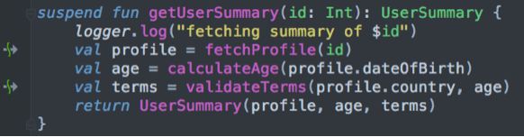

#                       Kotlin协程原理揭秘

* [The Internals of Concurrency in Kotlin] (https://tutorialwing.com/the-internals-of-concurrency-in-kotlin/)

```
    When working with Kotlin Coroutine,

    we should have an knowledge of how suspending computations actually wor,

    we should alse have an idea of Continuation Passing Style (CPS) ,which plays a important role to

    to suspending computations.

```

##   Continuation Passing Style
```
    The actual implementation of suspending computations is done using CPS,during the compiling time,the compiler will

    add a continuation parameter to suspending function.

    we can think of continuations as callbacks: whenever a suspending computations invokes another suspending computations,

    it will pass a continuation that should be called upon completion or error.

    To top this, the suspending computations are transformed into state machines that can save and restore their state, and execute one portion of their code at a time—so whenever they are resumed, they restore their state and continue execution where they left off.

    Coupling CPS with state machines, the compiler creates computations that can be suspended while waiting for other computations to complete.

```
##   Continuations
```
    public interface Continuation<in T> {
       public val context: CoroutineContext
       public fun resume(value: T)
       public fun resumeWithException(exception: Throwable)
    }

    The CoroutineContext that is to be used with this Continuation.

    A resume() function that takes a value T as a parameter. This value is the result of the operation that caused the suspension—so, if the function was suspended to call a function that returns an Int, the value will be that integer.

    A resumeWithException() function that allows for the propagation of an exception.

        suspend fun getUserSummary(id: Int): UserSummary {
            logger.log("fetching summary of $id")
            val profile = fetchProfile(id) // suspending function
            val age = calculateAge(profile.dateOfBirth)
            val terms = validateTerms(profile.country, age) // suspending funtion
            return UserSummary(profile, age, terms)
        }

    The compiler here is that the execution of getUserSummary() will happen through a Continuation. So, the compiler will use a Continuation to control the execution of getUserSummary(). In this case, the function suspends twice: first when fetchProfile() is invoked and later for the execution of validateTerms().


```

##   The suspend modifier
```
    One specific goal of the Kotlin team was to make as few language changes as possible in order to support concurrency.

    Instead, the impact of supporting coroutines and concurrency was to be taken by the compiler,

    the standard library, and the coroutines library. So, the only relevant change from a language perspective is the addition of the suspend modifier.

    This modifier indicates to the compiler that the code in the given scope—function or lambda—will work using continuations. So whenever a suspending computation is compiled, its bytecode will be a big continuation. For example, consider this suspending function:
```
 
```
    from the image above,we know that our function’s execution will happen in three steps.

    First, the function will be started and the log will be printed, then the invocation of fetchProfile() will cause the execution to suspend.

    Once fetchProfile() has ended, your function will calculate the age of the user, and then the execution will suspend again for validateTerms() to be executed.

    The last step will occur once the terms are validated when the function resumes one last time, and all the data from the previous steps are used to create the summary of the user.
```

*   State machine
*   Labels
*   Continuations
*   Callbacks
*   Incrementing the Label
*   Storing the Result From the Other Operations
*   Returning the Result of the Suspending Computation
*
*


